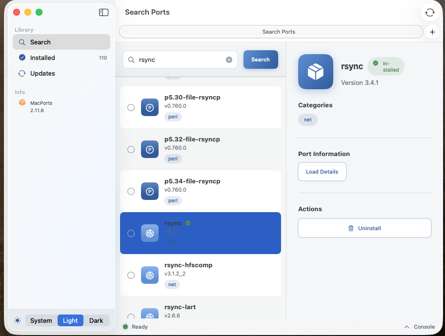

# MacPorts Utility

<p align="center">
  
  
  
</p>

A native macOS application for managing [MacPorts](https://www.macports.org/) packages with a beautiful, modern interface. Search, install, update, and manage your ports without touching the command line.



## Features

### Search & Discover
- **Powerful Search**: Find ports by name with real-time search
- **Rich Port Details**: View version, categories, and descriptions
- **Detailed Information**: Load comprehensive port info directly from MacPorts

### Package Management
- **Install Ports**: One-click installation with admin authentication
- **Batch Operations**: Select and install multiple ports at once with a single password prompt
- **Uninstall Ports**: Easily remove packages you no longer need
- **View Installed**: Browse all your installed ports with filtering and sorting

### Updates
- **Check for Updates**: See which ports have newer versions available
- **Update Individual Ports**: Update specific ports as needed
- **Update All**: One-click update for all outdated ports
- **Update Badges**: Visual indicators show which ports need attention

### User Experience
- **Native macOS Design**: Built with SwiftUI for a truly native look and feel
- **Dark Mode Support**: Full light and dark mode support with automatic switching
- **Keyboard Shortcuts**: Quick actions via menu shortcuts
- **Built-in Console**: Monitor operation progress and output in real-time
- **Status Bar**: Always see the current operation status

## Requirements

- **macOS 14.0 (Sonoma)** or later
- **[MacPorts](https://www.macports.org/install.php)** installed at `/opt/local/bin/port`
- **Xcode 15+** (for building from source)

## Installation

### From Source

1. Clone the repository:
   ```bash
   git clone https://github.com/yourusername/MacPortsUtility.git
   cd MacPortsUtility
   ```

2. Open the project in Xcode:
   ```bash
   open MacPortsUtility.xcodeproj
   ```

3. Build and run (⌘R)

### Prerequisites

Make sure MacPorts is installed on your system. If not, the app will prompt you to download it from the official website.

## Architecture

```
MacPortsUtility/
├── MacPortsUtilityApp.swift    # App entry point & menu commands
├── ContentView.swift           # Main navigation structure
├── Models/
│   └── Port.swift              # Port model & enums
├── Services/
│   └── PortsManager.swift      # Core MacPorts operations
├── Views/
│   ├── SearchView.swift        # Search interface
│   ├── InstalledView.swift     # Installed ports list
│   ├── UpdatesView.swift       # Updates management
│   ├── PortDetailView.swift    # Port details panel
│   └── PortRowView.swift       # Port list item component
├── Theme/
│   └── AppTheme.swift          # Colors, gradients & styles
└── Assets.xcassets/            # App icons & colors
```

## Keyboard Shortcuts

| Shortcut | Action |
|----------|--------|
| `⌘R` | Refresh installed ports |
| `⇧⌘S` | Sync port tree (selfupdate) |
| `⇧⌘I` | Open MacPorts download page |

## How It Works

MacPorts Utility interfaces with the `port` command-line tool installed at `/opt/local/bin/port`. The app executes MacPorts commands and parses their output to provide a graphical interface.

For operations requiring administrator privileges (install, uninstall, update, sync), the app uses AppleScript to prompt for admin credentials, ensuring a single password prompt for batch operations.

### Key Operations

| Operation | Command |
|-----------|---------|
| Search | `port search --name --glob "*query*"` |
| List Installed | `port installed` |
| Check Updates | `port outdated` |
| Install | `port install <portname>` |
| Uninstall | `port uninstall <portname>` |
| Update | `port upgrade <portname>` |
| Sync | `port selfupdate` |
| Port Info | `port info <portname>` |

## Theming

The app features a custom color palette inspired by enterprise software aesthetics with full dark mode support:

- **Brand Primary**: Professional blue (#2C5AA0)
- **Brand Accent**: Vibrant orange (#E76F2E) for actions and highlights
- **Adaptive Surfaces**: Automatically adjusts to system appearance

Toggle between Light, Dark, and System appearance modes via the sidebar footer or the app menu.

## License

This project is licensed under the MIT License.

## Contributing

Contributions are welcome! Please feel free to submit a Pull Request.

1. Fork the repository
2. Create your feature branch (`git checkout -b feature/AmazingFeature`)
3. Commit your changes (`git commit -m 'Add some AmazingFeature'`)
4. Push to the branch (`git push origin feature/AmazingFeature`)
5. Open a Pull Request

## Acknowledgments

- [MacPorts Project](https://www.macports.org/) for the incredible package management system
- Apple's SwiftUI framework for enabling beautiful native interfaces

## Disclaimer

This is an unofficial third-party application and is not affiliated with or endorsed by the MacPorts Project. Use at your own risk.
